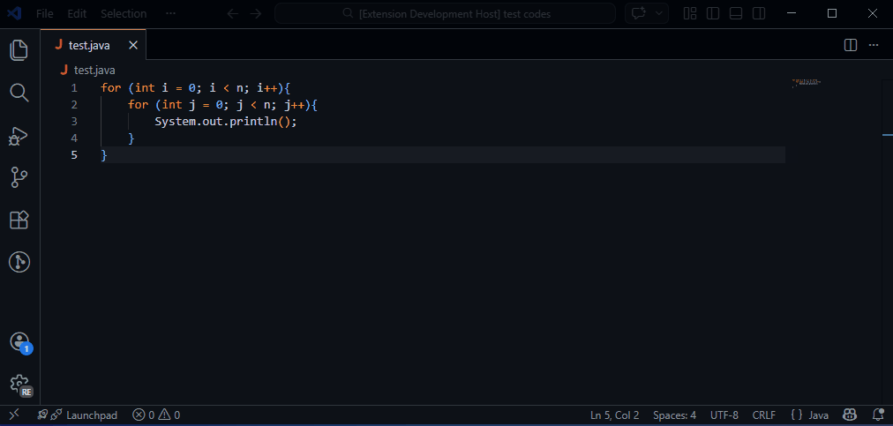

# AlgoX Time Complexity Analyzer

**AlgoX** is an Explainable AI (XAI) tool that predicts the runtime time complexity of Python and Java algorithms. 

Instead of just giving you a Big-O prediction, AlgoX uses **SHAP (SHapley Additive exPlanations)** to visually highlight the exact lines and tokens of code that influenced the model's decision, right inside your VS Code editor.

---

## 🚀 Features

* **Multi-Language Support:** Analyzes both Python and Java algorithms.
* **Hybrid AI Architecture:** Powered by a custom backend fusing AST-extracted static features (depth, branches, recursion) with a fine-tuned transformer model (UniXcoder).
* **Visual Explainability:** Applies color-coded background highlights directly to your code. 
  * 🔴 **Red Highlights:** Tokens that *increase* the complexity prediction.
  * 🔵 **Blue Highlights:** Tokens that *decrease* the complexity prediction.
* **Hover Insights:** Hover over any highlighted token to see its exact SHAP impact score.
* **7 Complexity Classes:** Detects `CONSTANT`, `LINEAR`, `LOGN`, `NLOGN`, `QUADRATIC`, `CUBIC`, and `NP`.

---

## 🛠️ Usage

1. Open any `.py` or `.java` file containing an algorithm. Optionally select a specific code snippet to analyze only that part.
2. Press `Ctrl + Shift + A` (or `Cmd + Shift + A` on Mac) to run the analysis.
3. Wait a moment for the AI to process the code. A notification will appear with the predicted complexity and confidence score.
4. Review the color-coded SHAP highlights in your editor.
5. To clear the highlights, press `Ctrl + Shift + C` (or `Cmd + Shift + C` on Mac).

Alternatively, you can access these commands via the VS Code Command Palette (`Ctrl+Shift+P`):
* `AlgoX: Analyze Time Complexity`
* `AlgoX: Clear Highlights`

---

## ⚙️ Requirements

This extension acts as the frontend client for the AlgoX AI model. To function, it requires the AlgoX FastAPI backend to be running. 

By default, the extension points to the local development server (`http://127.0.0.1:8000`). If you are using the hosted Hugging Face Spaces backend, you will need to update the API URL in the extension source code and recompile.

---

## 🐛 Known Issues

* **Whitespace Highlighting:** In rare cases, the BPE tokenizer may group newline characters with syntax, causing the highlight to slightly offset. The built-in source mapper mitigates most of this.
* **Cold Starts:** If the backend API is hosted on a free Hugging Face Space, the first request of the day may take up to 30-60 seconds while the container wakes up.

---

## 📝 Release Notes

### 1.0.0
* Initial release of the AlgoX Complexity Analyzer.
* Support for Java and Python.
* Integration with SHAP for XAI token highlighting.
